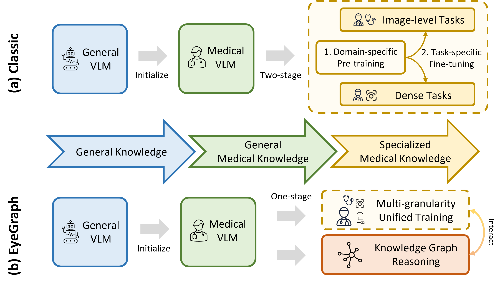
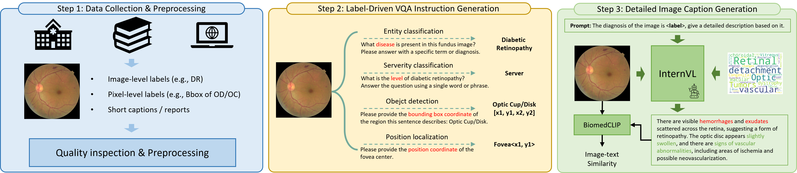

## **EyeGraph: A Multi-granularity Medical Vision-Language Foundation Model with Knowledge Graph Reasoning for Ophthalmic Interpretation**



The exponential growth of large vision-language models (VLMs) has unlocked numerous possibilities for multi-modal artificial intelligence systems in highly specialized fields, such as ophthalmology. However, the development of VLMs in this domain has not kept pace with advancements in general areas due to the scarcity of high-quality image-text paired data and the inherent category imbalances. We here, for the first time, propose EyeGraph, an ophthalmic VLM capable of handling multi-granularity tasks and equipped with knowledge graph-based reasoning capabilities. We also introduce TI-Retinal, a high-quality, multi-granularity, large-scale ophthalmic image-text dataset that aligns vision models with large language models. EyeGraph achieves state-of-the-art performance across seven clinically relevant benchmarks, including disease screening, diagnosis, structural detection/localization, and image captioning tasks. We construct a specialized knowledge graph for ophthalmology and design a knowledge graph-based think-on-graph (ToG) reasoning paradigm. This ToG approach not only demonstrates excellent performance on downstream benchmarks but also significantly enhances the the results' interpretability.

### **Data**


Our study utilizes a diverse array of retinal image datasets encompassing various pathologies and imaging modalities. These datasets support multiple tasks, including classification, detection, localization, and caption generation, reflecting their origins from a variety of sources, such as public datasets, competitions, and extractions from textbooks. The public datasets we used are list in following tables.
<table>
  <tr>
    <td>Eyepacs</td>
    <td>EyeQ</td>
    <td>OIA-ODIR</td>
    <td>JSIEC</td>
  </tr>
  <tr>
    <td>REFUGE</td>
    <td>PALM</td>
    <td>ADAM</td>
    <td>GAMMA</td>
  </tr>
  <tr>
    <td>MMAC</td>
    <td>KCD</td>
    <td>IDRiD</td>
    <td>ARMD</td>
  </tr>
  <tr>
    <td>AIROGS</td>
    <td>Messidor-2</td>
    <td>MM-Retina</td>
    <td>DeepEyeNet*</td>
  </tr>
</table>

### **Requriments**
To install all the required dependencies for this project, run the following command:

```bash
pip install -r requirements.txt
```
If you encounter issues related to GPU, CUDA versions, or the Transformers library during installation, please refer to [this webpage](https://github.com/OpenGVLab/InternVL/blob/main/INSTALLATION.md).

### **SFT Bash Script**
We used the supervised fine-tuning method with LoRA to train the Internvl1.5 mini-4B model. The specific training script can be found in `SFT_Lora.sh`. For details on the training data specifications, please refer to the `data` subfolder.


### **Test Example**
We have provided a trained test Jupyter Notebook `test_eyegraph.ipynb`, which includes example introductions for tasks such as classification, localization, and description. The pre-trained weights will be released later.

### Acknowledgements
We would like to express our gratitude for the valuable resources provided by the [InternVL](https://github.com/OpenGVLab/InternVL) repository, which greatly supported our project.