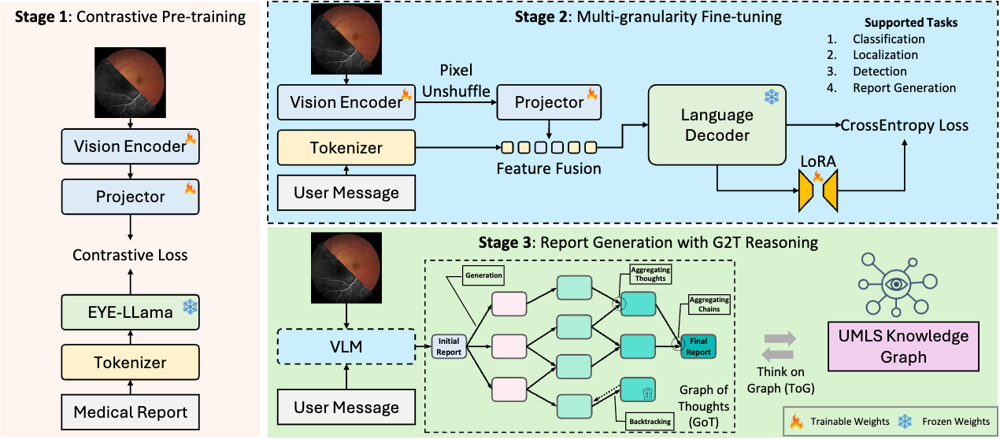
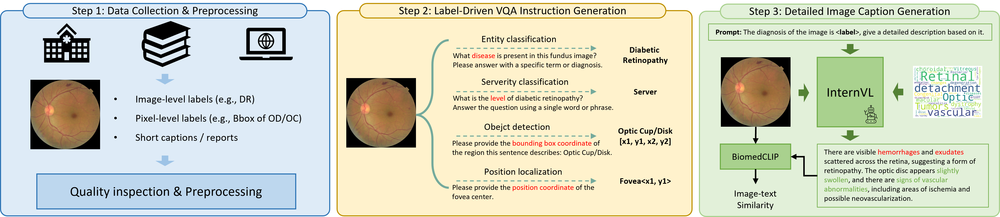
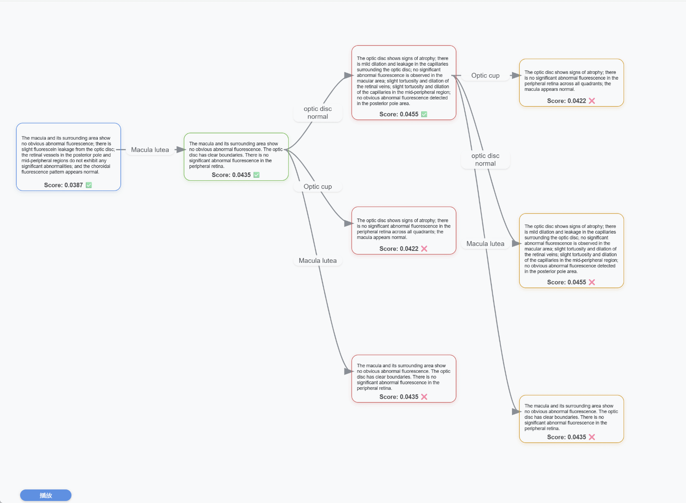

## **EyeGraph: A Multi-granularity Medical Vision-Language Foundation Model with Knowledge Graph Reasoning for Ophthalmic Interpretation**

### Online Demo

We have developed an online platform using Gradio that integrates all functionalities, including a basic chatbot Q&A and G2T reasoning for report generation. You can access and experience it at http://61.164.208.242:7860/gradio/. Additionally, we provide a video demo demonstrating the workflow on the platform. You can find in `img` directory `online_demo.mp4`

<video src="./img/online_demo.mp4"></video>

### Pipeline



### **Data**


Our study utilizes a diverse array of retinal image datasets encompassing various pathologies and imaging modalities. These datasets support multiple tasks, including classification, detection, localization, and caption generation, reflecting their origins from a variety of sources, such as public datasets, competitions, and extractions from textbooks. The public datasets we used are list in following tables.

<table>
  <tr>
    <td>Eyepacs</td>
    <td>EyeQ</td>
    <td>OIA-ODIR</td>
    <td>JSIEC</td>
  </tr>
  <tr>
    <td>REFUGE</td>
    <td>PALM</td>
    <td>ADAM</td>
    <td>GAMMA</td>
  </tr>
  <tr>
    <td>MMAC</td>
    <td>KCD</td>
    <td>IDRiD</td>
    <td>ARMD</td>
  </tr>
  <tr>
    <td>AIROGS</td>
    <td>Messidor-2</td>
    <td>MM-Retina</td>
    <td>Polyu (Private)</td>
  </tr>
</table>


### **Requriments**

To install all the required dependencies for this project, run the following command:

```bash
pip install -r requirements.txt
```

If you encounter issues related to GPU, CUDA versions, or the Transformers library during installation, please refer to [this webpage](https://github.com/OpenGVLab/InternVL/blob/main/INSTALLATION.md).

### Stage0: Vision-Language Contrastive Pre-training

We employ CLIP-based pre-training to enhance the representational capacity of the Vision Encoder while keeping the parameters of the large language model (LLM) frozen. Only the Vision Encoder is trained. This approach is implemented within the EYE-Llama-GQA framework.

### **Stage1: Multi-granularity Fine-tuning (SFT)**

We used the supervised fine-tuning method with LoRA to train the Internvl1.5 mini-4B model. The specific training script can be found in `SFT_Lora.sh`. For details on the training data specifications, please refer to the `data` subfolder.

We have provided a trained test Jupyter Notebook `test_eyegraph.ipynb`, which includes example introductions for tasks such as classification, localization, and description. The pre-trained weights will be released later.

### Report Generation with G2T Reasoning

We propose an innovative G2T reasoning paradigm that integrates a Graph of Thought (GoT) based reasoning mechanism with a Thinking on Graph (ToG) search method. By leveraging constraints from an external ophthalmic knowledge graph (KG) and optimizing reasoning steps through GoT, we effectively mitigate hallucinations and enhance the model’s reasoning capability. Experimental results demonstrate that G2T substantially boosts the report generation quality.

> The GIF below demonstrates a sample of the dynamic graph exploration process.



### Acknowledgements

We would like to express our gratitude for the valuable resources provided by the [InternVL](https://github.com/OpenGVLab/InternVL) repository, which greatly supported our project.